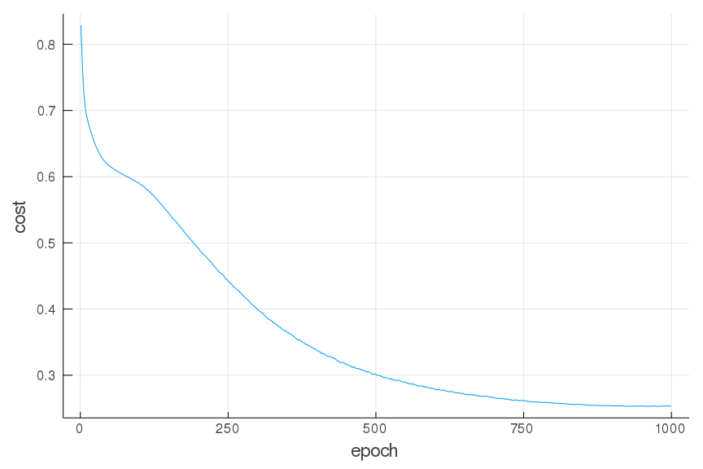

# FuNN.jl

## About

After taking the Coursera Deep Learning Specialization taught by Andrew Ng and learning a lot more about how artificial neural networks function, I wanted to implement my own from scratch as a FuNN way to solidify my understanding.

This neural network has the ability to set the number of layers and neurons per layer, the layers' activation functions (ReLU, tanh, logistic, or softmax), mini-batches, and a couple different gradient descent optimizations (momentum or Adam).
$L^2$-regularization is used with basic mini-batch gradient descent to reduce overfitting.

This project was a learning experience and is not intended for production use as there are much more robust deep learning packages available (e.g. [Flux.jl](https://github.com/FluxML/Flux.jl)).

## Basic Usage

```Julia
using FuNN
using Random
using Plots; gr()

# Generate some random data
rng = MersenneTwister(8);
X = rand(rng, 2, 1000);
R = X[1, :].^2 + X[2, :].^2;
Y = (R .< 0.75) * 1.0;
Y = reshape(Y, (1, length(Y)));
X_test = rand(rng, 2, 10000);
R_test = X_test[1, :].^2 + X_test[2, :].^2;
Y_test = (R_test .< 0.75) * 1.0;
Y_test = reshape(Y_test, (1, length(Y_test)));

# Set the layer sizes and any other desired parameters
params_dict = Dict("layer_sizes" => [4, 1]);

# Set the hyperparameters
hparams_dict = Dict("learning_rate" => 0.01, "optimization" => "momentum");

# Initialize the NeuralNetwork type (we can set the precision with the T kwarg)
NN = NeuralNetwork(X, Y, T=Float32, params_dict=params_dict, hparams_dict=hparams_dict);

# Train the neural network over 1000 epochs
train!(NN, 1000);

# Let's check the accuracy on the training set
Y_hat = predict(NN, X) .> 0.5;
println("Train Accuracy: ", sum(Y_hat .== Y) / size(Y, 2))

> Train Accuracy: 0.903

# Let's check the accuracy on the test set
Y_hat_test = predict(NN, X_test) .> 0.5;
println("Test Accuracy: ", sum(Y_hat_test .== Y_test) / size(Y_test, 2))

> Test Accuracy: 0.9123

# We can look at the cost function as well
plot(1:length(NN.J), NN.J, xaxis="epoch", yaxis="cost", legend=false)
```


